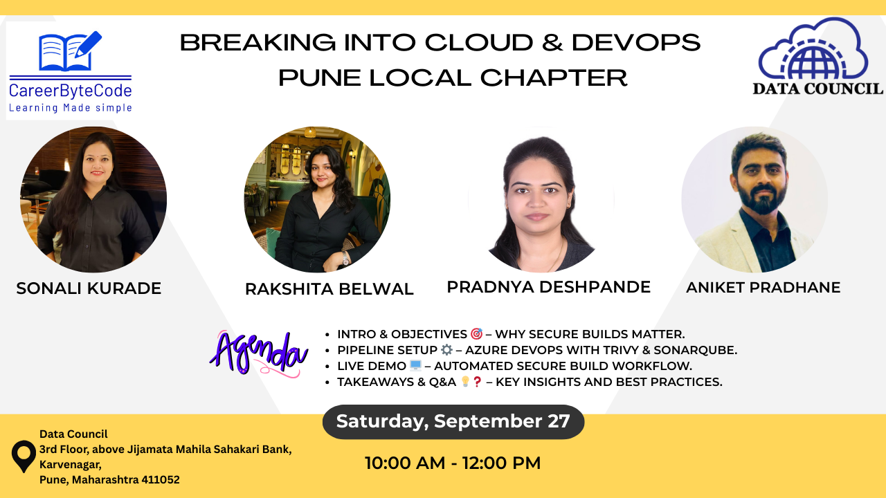

# 🚀 Cloud & DevOps Career Growth Meetup – Pune

**🎯 Theme:** *Cloud & DevOps Career Growth + Real-World Insights*  

---

## 🌟 Meetup Highlights
- 🏢 **Location:** Karve Nagar, Pune  
- 📅 **Date:** 27th September 2025 (Saturday)  
- ⏰ **Time:** 10:00 AM – 12:00 PM IST  
- 👥 **Audience:** IT Professionals, Job Seekers, Students  
- 🎁 **Giveaways:** Platform access, resume review, mock interviews, swags  
- 💡 **Focus:** Hands-on learning, real-time projects, industry insights  

---

## 🟢 1️⃣ Opening Session
**⏰ Time:** 10 mins  
**👤 Speaker:** Aniket  

**Agenda:**
- 👋 Welcome attendees  
- 🎯 Share meetup objectives  
- ❄️ Icebreaker: Introduce yourself in **one line**:  
  `"Name + One word about what you expect today"`

---

## 🟢 2️⃣ Job Seekers’ Struggles & Solutions
**⏰ Time:** 10 mins  
**👤 Speaker:** Rakshita  

**Content:**
- ⚠️ Common problems job seekers face  
- 💡 Practical solutions to overcome challenges  

**💬 Audience Engagement Questions (Examples):**
1. What is the biggest challenge you face in interviews?  
2. How confident are you with real-time project experience?  
3. Have you faced rejections due to lack of hands-on exposure?  
4. Which DevOps/Cloud skill do you struggle with most?  
5. What type of guidance would help you the most?  

*(You can add 15 more questions in similar style)*

---

## 🟢 3️⃣ Real-Time Project Walkthrough
**⏰ Time:** 35 mins  
**👤 Speaker:** Pradnya  

**Content:**
- 📚 Concept explanation and hands-on demo  
- 🛠 Demo of a real project (Cloud/DevOps pipeline, monitoring setup, migration, etc.)  
- ⚡ Challenges faced & solutions implemented  
- ❓ Q&A (5 mins)  

**🔗 Project Link:** [Automating Secure Builds with Azure DevOps, Trivy Integration, and SonarQube](https://careerbytecode.substack.com/p/automating-secure-builds-with-azure-devops-trivy-integration-and-sonarqube)

---

## 🟢 4️⃣ Tea / Networking Break ☕
**⏰ Time:** 15–20 mins  

**Activity:**
- 🤝 Mingle, exchange contacts, discuss learnings so far  

---

## 🟢 5️⃣ Industry Trends & Future Skills + Panel Discussion
**⏰ Time:** 20 mins  
**👤 Speaker:** Sonali  

**Content:**
- 🔮 In-demand skills for 2025+  
- 🤖 AI + DevOps, 🌐 Multi-cloud, 🔒 Security focus, ⚙️ Automation tools  
- 📌 How to stay relevant in a rapidly changing industry  

---

## 🟢 6️⃣ Closing & Networking
**⏰ Time:** 15 mins  
**👤 Speaker:** Sonali  

**Content:**
- 📝 Recap main takeaways  
- 🙏 Thank speakers & attendees  
- 📢 Share upcoming plans/events  
- 📸 Group photo + free networking  

---

## 🎁 Engagement & Giveaways
- ✅ Platform Access  
- ✅ Free Resume Review  
- ✅ Mock Interview Session  
- ✅ Small Swags  

---

## 📝 Attendee Checklist
Before attending, please make sure to:  
- [ ] Bring your laptop (if possible)  
- [ ] Prepare **one-line self-introduction**  
- [ ] Create accounts: Canva & LinkedIn  
- [ ] Be ready to network & ask questions  

---

## 📸 Visuals & Experience
- Hands-on demos 🖥️  
- Real-time project walkthroughs 🔧  
- Networking & career guidance 🤝  
- Fun giveaways 🎁  
- Q&A with experts ❓  

---

## 🔗 Useful Links
- CareerByteCode Substack: [Project Walkthrough](https://careerbytecode.substack.com/p/automating-secure-builds-with-azure-devops-trivy-integration-and-sonarqube)

---

## 🔗 Join & Connect  

🔗 **Join the Pune Chapter WhatsApp Group for updates, enrollment & future events:**  
[Join WhatsApp Group](https://chat.whatsapp.com/GBWWMIWEzdq1PtzSk7ZF23)  

🙋 **In case of any queries, feel free to reach out to our Pune Leaders:**  
- Sonali Kurade – [LinkedIn](https://www.linkedin.com/in/techopsbysonali/)  
- Pradnya Deshpande – [LinkedIn](https://www.linkedin.com/in/pradnyadeshpande10/)  
- Rakshita Belwal – [LinkedIn](https://www.linkedin.com/in/rakshitabelwal/)  
- Aniket Pradhane – [LinkedIn](https://www.linkedin.com/in/aniket-pradhane-15399780/)  

✅ Invite your friends too – let’s learn, share, and grow together! 🌟  

📌 **Note:** Everyone attending the local event as part of our community initiative will receive **free access to our platform subscription**.  
